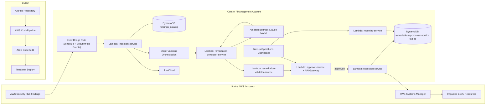

# AI-Assisted Vulnerability Remediation Platform

AWS-native, serverless-first remediation control plane for enterprise-scale vulnerability operations.

## Overview

The AI-Assisted Vulnerability Remediation Platform is a centralized security operations control plane designed to automate ingestion, analysis, approval, execution, and reporting of vulnerability remediation workflows across AWS environments.

The platform combines:

- AWS Security Hub
- AWS Step Functions
- AWS Lambda
- Amazon Bedrock
- AWS Systems Manager (SSM)

to create a safe, auditable, approval-driven remediation system that reduces operational overhead while maintaining strict governance and security controls.

## Core Objectives

- Centralize cross-account vulnerability intake
- Normalize and deduplicate findings
- Generate AI-assisted remediation proposals
- Enforce human-reviewed approval workflows
- Execute approved remediations safely through AWS Systems Manager
- Maintain complete audit and reporting history
- Provide near-real-time operational visibility

## Key Design Principles

### Security First

- Human approval by default
- AI proposes, humans approve
- Allowlist-only remediation execution
- Least-privilege IAM everywhere
- KMS encryption across all storage layers
- Unsafe remediation patterns fail closed

### Serverless-First

The platform is fully event-driven and optimized for low operational overhead using:

- AWS Lambda
- Step Functions
- EventBridge
- DynamoDB
- API Gateway

### Enterprise Auditability

- Append-only approval history
- Immutable execution records
- CloudTrail integration
- Full SSO/Federated identity attribution
- Exportable operational and leadership reporting

## High-Level Architecture

### Control Plane Components

| Service | Purpose |
| --- | --- |
| AWS Security Hub | Primary vulnerability source |
| EventBridge | Scheduled orchestration |
| Step Functions | Workflow orchestration |
| Lambda | Business logic and processing |
| DynamoDB | Operational state and metadata |
| Amazon Bedrock | AI remediation generation |
| AWS Systems Manager | Remediation execution |
| API Gateway | API layer |
| CloudWatch | Monitoring and observability |
| S3 | Artifact and log storage |
| KMS | Encryption and key management |

### End-to-End Architecture Diagram



### Architecture Pattern

#### Centralized Management Account

The management account hosts:

- orchestration workflows
- remediation pipelines
- reporting services
- operational state
- Bedrock integration
- dashboards and APIs

#### Spoke Account Model

Target AWS accounts expose scoped IAM roles for:

- Security Hub ingestion
- SSM remediation execution
- validation and verification workflows

## Platform Workflow

### 1. Finding Ingestion

- EventBridge triggers scheduled ingestion
- Lambda reads onboarded account configuration
- System assumes target account role
- Security Hub findings are fetched
- Findings normalized into common schema
- Duplicate findings collapsed
- Findings stored in `findings_catalog`

### 2. AI Remediation Generation

- Findings enter `needs_plan`
- Amazon Bedrock intelligently generates an executable remediation script and rollback guidance tailored to the finding context and OS
- Validation pipeline evaluates proposal
- Unsafe patterns rejected automatically
- Approved drafts stored in `remediation_plans`

### 3. Human Review and Approval

Security and DevOps engineers can:

- review generated plans
- edit remediation scripts
- reject unsafe remediations
- mark findings as:
  - false positive
  - accepted risk
  - not automatable

Approval states include:

- `approved_manual`
- `approved_auto`

### 4. Remediation Execution

- Approved workflows selected
- Rollout policy validated
- SSM commands executed
- Execution telemetry collected
- Security Hub revalidation performed
- Final state updated

## Safety and Guardrails

### Allowed Actions

- package updates
- approved service restarts
- controlled configuration changes
- permission corrections

### Blocked Actions

- kernel upgrades
- destructive package removals
- unrestricted shell execution
- application-specific mutations
- unapproved infrastructure changes

### Rollback Requirements

Every remediation must include:

- executable rollback command
- OR documented rollback procedure

No remediation can move into auto-execution without rollback coverage.

## Finding Lifecycle

`new` -> `needs_review` -> `needs_plan` -> `needs_approval` -> `approved_manual` -> `approved_auto` -> `in_progress` -> `pending_verification` -> `resolved` -> `failed` -> `exception`

## Data Model

### Primary Tables

#### findings_catalog

Stores normalized and deduplicated findings.

#### finding_targets

Stores impacted account/resource mappings.

#### remediation_plans

Stores:

- AI-generated drafts
- approved plans
- rollback scripts
- validation metadata
- OS-specific variants

#### approval_history

Append-only approval and governance audit history.

#### execution_history

Append-only remediation execution history.

#### reporting_aggregates

Pre-aggregated operational and business metrics.

## AI Design

### Bedrock Strategy

The platform uses:

- one primary remediation generation model
- one independent validator model
- deterministic policy validation after model output

### AI Output Requirements

Generated remediation packages must include:

- executable remediation
- rollback guidance
- impact analysis
- risk classification
- automation recommendation
- validation recommendation

## Security Model

### IAM Principles

- least privilege everywhere
- no direct DynamoDB access from browsers
- role-based approval enforcement
- scoped cross-account AssumeRole access

### Encryption

- KMS-encrypted DynamoDB tables
- KMS-encrypted S3 buckets
- encrypted CloudWatch log groups
- environment isolation by account

## Observability

### Monitoring

- ingestion failures
- execution failures
- approval backlog age
- validator rejection spikes
- SLA breach indicators
- remediation verification lag

### Tooling

- CloudWatch metrics
- Grafana dashboards
- OpenTelemetry tracing
- structured logging
- audit exports

## CI/CD and Infrastructure

### Infrastructure as Code

- Terraform
- AWS Organizations
- AWS Control Tower

### Deployment Pipeline

- AWS CodePipeline and CodeBuild driven deployments (provisioned by Terraform)
- multi-account promotion strategy
- non-production-first rollout model

## API and UI

### Frontend

- Next.js
- TailwindCSS
- shadcn/ui

### Backend

- API Gateway
- Lambda service layer
- DynamoDB
- Step Functions

### User Capabilities

- list and filter findings
- review remediation plans
- approve/reject workflows
- rerun generation/execution
- export reports
- manage exceptions and comments

## Reporting

### Operational Reporting

- finding counts by severity
- backlog visibility
- execution failures
- pending verification
- SLA tracking

### Leadership Reporting

- application-level summaries
- prod vs non-prod metrics
- exception reporting
- patch-cycle visibility
- remediation trend analysis

## Cost Optimization

The platform is optimized for low AWS operational cost using:

- serverless-first architecture
- deduplicated findings
- event-driven workflows
- Bedrock invocation minimization
- pre-aggregated reporting
- CloudWatch/S3 log offloading

## Rollout Plan

### Phase 1 - Foundation

- ingestion
- normalization
- deduplication
- catalog APIs

### Phase 2 - AI Authoring

- Bedrock remediation generation
- validator workflows
- approval workflows

### Phase 3 - Controlled Non-Prod Execution

- SSM execution
- rollback enforcement
- verification loop

### Phase 4 - Reporting and Hardening

- dashboards
- exports
- operational analytics
- SLA monitoring

### Phase 5 - Production Rollout

- governance approvals
- staged enablement
- production safety enforcement

## Acceptance Criteria

- Cross-account Security Hub ingestion works reliably
- Findings are deduplicated correctly
- AI-generated and approved plans are preserved
- Auto-execution requires rollback guidance and approval
- Audit history retained for minimum 13 months
- Real-time dashboards function without raw log scanning
- All actions attributable to authenticated users

## Future Roadmap

- Wiz ingestion
- Tenable ingestion
- EKS/container remediation
- GitHub Actions integration
- Ansible artifact generation
- Production auto-remediation expansion

## Recommended Technology Stack

### Infrastructure

- Terraform
- AWS Organizations
- AWS Control Tower

### Backend

- Python
- AWS Lambda
- boto3

### Frontend

- Next.js
- TailwindCSS
- shadcn/ui

### AI

- Amazon Bedrock
- Claude models
- Prompt templates
- Multi-model validation

## Repository Structure

```text
repo-root/
├── infrastructure/
│   ├── terraform/
│   ├── modules/
│   └── environments/
├── services/
│   ├── ingestion-service/
│   ├── remediation-generator-service/
│   ├── remediation-validator-service/
│   ├── approval-service/
│   ├── execution-service/
│   ├── reporting-service/
│   └── shared/
├── frontend/
│   ├── app/
│   ├── components/
│   ├── lib/
│   └── ui/
├── docs/
├── example/
│   └── ec2-nginx-remediation/
├── scripts/
├── .github/
└── README.md
```

## Local Development

1. Install dependencies:

```bash
npm install
```

2. Build all packages:

```bash
npm run build
```

3. Run service tests:

```bash
npm run test
```

4. Launch frontend:

```bash
npm run dev --workspace frontend
```

5. Validate infrastructure:

```bash
cd infrastructure/terraform/live/nonprod
terraform init
terraform validate
```

## Example: EC2 Nginx Vulnerability Remediation

Use the runnable example in `example/ec2-nginx-remediation` to deploy an EC2 instance with an outdated nginx baseline and execute remediation via this platform.

1. Deploy vulnerable example:

```bash
cd example/ec2-nginx-remediation
terraform init
terraform apply -var="admin_cidr=<your-cidr>"
```

2. Follow remediation flow instructions:

```bash
open example/ec2-nginx-remediation/README.md
```

3. Validate nginx remediation outcome via SSM and Security Hub re-check.
